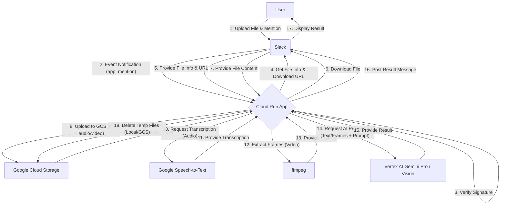

# Slack Bot × Google AI Studio Integration (Cloud Run 版)

## 概要

このリポジトリは、Slackに投稿された音声ファイルや動画ファイルの内容を、Google CloudのAIサービス（Vertex AI Gemini, Speech-to-Text）を利用して処理し、結果をSlackのスレッドに返信するBotのソースコードです。

ユーザーがSlackチャンネルに音声または動画ファイルをアップロードし、そのファイルが含まれるスレッドでBotにメンション（例: `@bot 要約して`）を送ると、Botがファイルを処理し、要約や文字起こしなどの結果を同じスレッドに投稿します。

このアプリケーションは、Google Cloud Run上での動作を想定して構築されています。

## アーキテクチャ



**主要コンポーネント:**

*   **Slack App**:
    *   ユーザーからのファイルアップロードとメンションを受け付けます。
    *   `app_mention` イベントをCloud Runに送信します。
    *   ファイルのダウンロードURLを提供し、処理結果を表示します。
*   **Cloud Run Application (Node.js/Express)**:
    *   SlackからのWebhookリクエスト（イベント通知）を受け取ります。
    *   Slack署名を検証してリクエストの正当性を確認します。
    *   Slack APIを利用してファイル情報を取得し、ファイルをダウンロードします。
    *   必要に応じてファイルをGoogle Cloud Storage (GCS) にアップロードします。
    *   Google Cloud Speech-to-Text APIを利用して音声ファイルの文字起こしを行います。
    *   `ffmpeg` を利用して動画ファイルから音声やフレーム画像を抽出します。
    *   Vertex AI Gemini API (Pro / Pro Vision) を利用して、文字起こし結果や画像に基づき、ユーザーのコマンド（要約、議事録作成など）に応じた処理を実行します。
    *   処理結果をSlack APIを利用して元のスレッドに投稿します。
    *   一時ファイル（ローカル、GCS）をクリーンアップします。
*   **Google Cloud Services**:
    *   **Vertex AI (Gemini Pro / Pro Vision)**: テキスト生成、要約、動画内容の理解などのAI処理を担当します。
    *   **Speech-to-Text**: 音声ファイルの文字起こしを担当します。
    *   **Cloud Storage**: 音声ファイルなどを一時的に保存するために使用されます（Speech-to-Text APIの要件など）。
*   **ffmpeg**: 動画ファイルから音声やフレーム画像を抽出するために、Cloud Runコンテナ内にインストールされている必要があります。

## 機能

*   Slackの `app_mention` イベントをトリガーとして動作します。
*   メンションが送られたスレッド内の最新の音声ファイルまたは動画ファイルを処理対象とします。
*   メンション内のテキストからコマンド（例: `要約して`, `議事録作成`, `分析して`）を解析し、それに応じたAI処理を実行します。
    *   デフォルトのコマンドは「要約」です。
*   処理の開始、完了、エラー発生をユーザーに通知します。
*   処理結果を元のSlackスレッドにメッセージとして投稿します。
*   対応ファイル形式:
    *   音声: `mp3`, `m4a`, `wav`, `ogg`, `flac`
    *   動画: `mp4`, `mov`, `avi`, `webm`, `mkv`

## 使用技術

*   **言語**: Node.js
*   **フレームワーク**: Express.js
*   **実行環境**: Google Cloud Run (Dockerコンテナ)
*   **AI**:
    *   Google Vertex AI Gemini Pro
    *   Google Vertex AI Gemini Pro Vision
    *   Google Cloud Speech-to-Text
*   **ストレージ**: Google Cloud Storage (一時利用)
*   **API**:
    *   Slack Events API
    *   Slack Web API
*   **ライブラリ**:
    *   `@google-cloud/vertexai`
    *   `@google-cloud/speech`
    *   `@google-cloud/storage`
    *   `@slack/bolt` または `axios` (Slack API通信用 - ※現状はaxiosが使われているようです)
    *   `express`
    *   `body-parser`
    *   `dotenv`
    *   `axios` (ファイルダウンロード用)
    *   `uuid`
    *   `winston` (ロギング用 - ※現状は`logger.js`でカスタム実装されているようです)
*   **その他**:
    *   `ffmpeg` (動画処理に必要)
    *   Docker

## セットアップと実行

### 1. 前提条件

*   Node.js (開発環境)
*   Google Cloud SDK (`gcloud` CLI)
*   Docker (Cloud Run デプロイの場合)
*   `ffmpeg` (動画処理を行う場合、実行環境に必要)
*   Slack Appの作成と設定 (Bot Token, Signing Secret)
*   Google Cloud プロジェクトと以下の API の有効化:
    *   Vertex AI API (または Generative Language API)
    *   Cloud Functions API
    *   Cloud Build API (デプロイ時に使用される)
    *   Artifact Registry API (コンテナイメージを保存する場合)
    *   (オプション) Cloud Storage API (GCS を使用する場合)
    *   (オプション) Cloud Logging API, Cloud Monitoring API
*   **サービスアカウントの作成と設定 (初回デプロイ時):**
    *   Cloud Functions が使用するサービスアカウントを作成します。例:
        ```bash
        gcloud iam service-accounts create slack-bot-sa --display-name="Slack Feedback Bot Service Account" --project={YOUR_GCP_PROJECT_ID}
        ```
    *   作成したサービスアカウントに必要な IAM ロールを付与します。最低限、Gemini API を使用するために `roles/aiplatform.user` が必要です。
        ```bash
        gcloud projects add-iam-policy-binding {YOUR_GCP_PROJECT_ID} --member="serviceAccount:slack-bot-sa@{YOUR_GCP_PROJECT_ID}.iam.gserviceaccount.com" --role="roles/aiplatform.user"
        ```
    *   作成したサービスアカウントのメールアドレスをメモしておき、後述のデプロイスクリプト (`deploy.sh`) 内の `SERVICE_ACCOUNT` 変数に設定します。

### 2. 環境変数の設定

プロジェクトルートに `.env` ファイルを作成し、以下の環境変数を設定します。(`env-example.txt` を参考にしてください)

```
# Slack
SLACK_BOT_TOKEN=xoxb-...
SLACK_SIGNING_SECRET=...

# Google Cloud
GCP_PROJECT_ID=your-gcp-project-id
GCP_LOCATION=your-gcp-region # 例: us-central1
GOOGLE_APPLICATION_CREDENTIALS=/path/to/your/service-account-key.json # ローカル実行時 or Dockerビルド時に含める場合
GCS_BUCKET_NAME=your-gcs-bucket-name # 一時ファイル用

# アプリケーション設定
PORT=8080
LOG_LEVEL=info
```

**注意:** `GOOGLE_APPLICATION_CREDENTIALS` は、Cloud Run環境では通常、実行サービスアカウントにロールを付与することで自動的に認証されます。ローカルでのテストや、キーファイルをコンテナに含める場合にのみ設定が必要です。

### 3. 依存関係のインストール

```bash
npm install
```

### 4. ローカルでの実行 (テスト用)

```bash
npm start
```
別途、ngrokなどのツールを使用して、ローカルサーバーを外部公開し、Slack AppのRequest URLに設定する必要があります。

### 5. Dockerイメージのビルド

`dockerfile.txt` を `Dockerfile` にリネームし、内容を確認・調整してください（特に `ffmpeg` のインストール部分）。

```bash
docker build -t your-image-name .
```

### 6. Cloud Functions (Gen 2) へのデプロイ

プロジェクトルートにある `deploy.sh` スクリプトを使用してデプロイします。

1.  **スクリプトの編集:** `deploy.sh` を開き、`FUNCTION_NAME`, `REGION`, `SERVICE_ACCOUNT` などの設定項目を自分の環境に合わせて編集します。
2.  **環境変数の設定:** スクリプトを実行するターミナルで、`.env` ファイルに記載した必要な環境変数 (SLACK_BOT_TOKEN, SLACK_SIGNING_SECRET, GCP_PROJECT_ID, GCS_BUCKET_NAME, GEMINI_API_KEY) をエクスポートします。
    ```bash
    export SLACK_BOT_TOKEN="your_token"
    export SLACK_SIGNING_SECRET="your_secret"
    # ... 他の変数も同様にエクスポート
    # または source .env コマンドが使える場合:
    # source .env
    ```
3.  **スクリプトの実行:**
    ```bash
    ./deploy.sh
    ```

スクリプトは `gcloud functions deploy` コマンドを実行し、Cloud Functions (第2世代) にアプリケーションをデプロイします。

**注意:** 初回デプロイ時には、前提条件で作成したサービスアカウントが正しく設定されていることを確認してください。

デプロイ後、表示される HTTPS エンドポイント URL (`https://...run.app`) を Slack App のイベントサブスクリプション設定（Request URL）に登録します。

---

**(参考) Cloud Run へのデプロイ (Dockerfile を使用する場合)**

もし Cloud Run を使用する場合は、`Dockerfile` を用意し、以下の手順でデプロイします。

1.  **Docker イメージのビルド:**
    ```bash
    docker build -t gcr.io/{YOUR_GCP_PROJECT_ID}/slack-feedback-bot:latest .
    ```
2.  **Artifact Registry へのプッシュ:**
    ```bash
    docker push gcr.io/{YOUR_GCP_PROJECT_ID}/slack-feedback-bot:latest
    ```
3.  **Cloud Run へのデプロイ:**
    ```bash
# Artifact Registryにプッシュ (例)
    gcloud run deploy slack-feedback-bot-service \
      --image gcr.io/{YOUR_GCP_PROJECT_ID}/slack-feedback-bot:latest \
      --platform managed \
      --region {YOUR_REGION} \
      --allow-unauthenticated \
      --service-account {YOUR_SERVICE_ACCOUNT_EMAIL} \
      --set-env-vars SLACK_BOT_TOKEN={YOUR_SLACK_BOT_TOKEN},SLACK_SIGNING_SECRET={YOUR_SLACK_SIGNING_SECRET},GCP_PROJECT_ID={YOUR_GCP_PROJECT_ID},GCS_BUCKET_NAME={YOUR_GCS_BUCKET_NAME},GEMINI_API_KEY={YOUR_GEMINI_API_KEY},LOG_LEVEL=info
    ```
    **注意:** 環境変数は Cloud Run のシークレットマネージャーを利用することを推奨します。

デプロイ後、Cloud Run サービスのエンドポイント URL を Slack App のイベントサブスクリプション設定（Request URL）に登録します。

## 設定

いくつかの設定は `config/config.js` で管理されています。

*   `GCP_PROJECT_ID`, `GCP_LOCATION`: Google Cloudの設定。
*   `GCS_BUCKET_NAME`: 一時ファイル保存用のGCSバケット名。
*   Geminiモデルの設定 (`generation_config`) など。

## コマンド例

Slackのスレッド内で、Botに対して以下のようにメンションします。

*   `@<bot名> 要約して`
*   `@<bot名> この会議の内容で議事録を作成して`
*   `@<bot名> 分析`
*   `@<bot名>` (デフォルトで要約を実行)

## 注意点

*   **ffmpeg**: 動画ファイルを処理する場合、実行環境（Cloud Runコンテナ）に `ffmpeg` がインストールされている必要があります。Dockerfileに必要なインストール手順を含めてください。
*   **Google Cloud認証**: Cloud RunからGoogle Cloud API（Vertex AI, Speech-to-Text, GCS）を呼び出すための認証設定が必要です。推奨される方法は、Cloud Runサービスに適切なIAMロール（Vertex AIユーザー、Speech-to-Textユーザー、Storageオブジェクト作成者/閲覧者/削除者など）を持つサービスアカウントを割り当てることです。
*   **Slack App設定**:
    *   **イベントサブスクリプション**: `app_mention` イベントを購読する必要があります。
    *   **権限スコープ**: Bot Token Scopesに `app_mentions:read`, `chat:write`, `files:read`, `channels:history`, `groups:history`, `im:history`, `mpim:history` などが必要です。
*   **タイムアウト**: Slackはイベント通知に対して3秒以内に応答することを期待します。そのため、アプリケーションはまず `200 OK` を返し、実際の処理は非同期で行う必要があります（実装済み）。
*   **コスト**: Google Cloudの各サービス（Vertex AI, Speech-to-Text, Cloud Storage, Cloud Run）には利用料金が発生します。料金体系を確認してください。
*   **エラーハンドリング**: エラーが発生した場合、基本的なエラーメッセージがSlackに投稿されますが、詳細はCloud Loggingなどで確認する必要があります。
